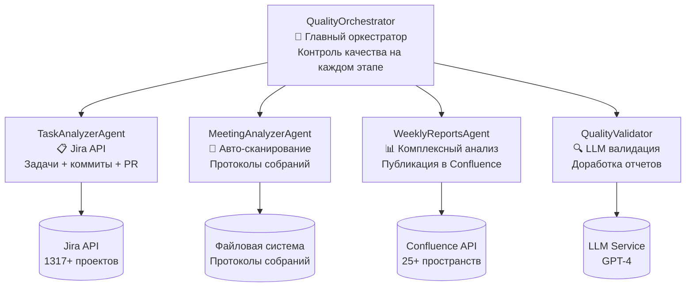

# MTS MultAgent - Employee Monitoring System

<div align="center">


  
**Автоматизированная система мониторинга и аналитики производительности сотрудников с использованием LLM**

[](https://python.org)
[](LICENSE)
[](#status)
[ ](#архитектура)

</div>

---

## 🎯 Обзор системы

**MTS MultAgent Employee Monitoring System** - это интеллектуальная система для автоматического мониторинга и анализа производительности сотрудников, разработанная для MTS. Система использует современные AI технологии для анализа данных из Jira, протоколов собраний и генерации комплексных отчетов.

### 🚀 Ключевые возможности

- 🔍 **Автоматический анализ Jira задач** с отслеживанием коммитов и Pull Request
- 📝 **Интеллектуальный анализ протоколов собраний** с оценкой вовлеченности
- 📊 **Еженедельные комплексные отчеты** с публикацией в Confluence
- 🎯 **LLM-контроль качества** с автоматической доработкой отчетов
- ⏰ **Автоматическое расписание** с гибкими настройками
- 🎮 **Интерактивное управление** через CLI интерфейс

---

## 🏗️ Архитектура системы

### 🔄 Новый архитектурный паттерн (исправленный)



### 📋 Компоненты системы

| Компонент | Роль | Основные функции | Статус |
|-----------|------|------------------|--------|
| **QualityOrchestrator** | Главный оркестратор | Координация, контроль качества, доработка | 🔧 В разработке |
| **TaskAnalyzerAgent** | Анализатор задач | Jira API, анализ производительности | 🔧 Требует исправлений |
| **MeetingAnalyzerAgent** | Анализатор встреч | Сканирование протоколов, анализ активности | 🔧 Требует исправлений |
| **WeeklyReportsAgent** | Генератор отчетов | Комплексный анализ, Confluence публикация | ✅ Работает |
| **QualityValidatorAgent** | Валидатор качества | LLM-проверка, оценка качества | ✅ Работает |

---

## ⚡ Быстрый старт

### 📋 Требования

- **Python:** 3.10+
- **Операционная система:** Linux/macOS/Windows
- **Доступы:** Jira API, Confluence API, LLM сервис
- **Память:** 512MB+ RAM
- **Диск:** 1GB+ свободного места

### 🚀 Установка

```bash
# 1. Клонирование репозитория
git clone https://github.com/PavelVM209/MTS_MultAgent.git
cd MTS_MultAgent

# 2. Создание виртуального окружения
python3 -m venv venv
source venv/bin/activate  # Linux/macOS
# или
venv\Scripts\activate  # Windows

# 3. Установка зависимостей
pip install -r requirements.txt

# 4. Конфигурация
cp .env.example .env
# Отредактируйте .env с вашими credentials
```

### 🔧 Конфигурация

#### **Основные настройки (.env)**
```bash
# Jira API Configuration
JIRA_URL="https://your-company.atlassian.net"
JIRA_USERNAME="your-email@company.com"
JIRA_API_TOKEN="your-api-token"

# Confluence API Configuration  
CONFLUENCE_URL="https://your-company.atlassian.net/wiki"
CONFLUENCE_USERNAME="your-email@company.com"
CONFLUENCE_API_TOKEN="your-api-token"

# LLM Configuration
OPENAI_API_KEY="your-openai-key"
# или
YANDEX_API_KEY="your-yandex-key"

# Protocols Directory
PROTOCOLS_DIRECTORY="/data/meeting-protocols"
```

#### **Расширенная конфигурация (config/employee_monitoring.yaml)**
```yaml
employee_monitoring:
  jira:
    project_keys: "ROOBY,0BF,DEV"
    query_filter: "status in (In Progress, Done, To Do) AND updated >= -7d"
    
  protocols:
    directory_path: "/data/meeting-protocols"
    file_formats: ["txt", "pdf", "docx"]
    
  scheduler:
    daily_analysis_time: "09:00"
    weekly_report_time: "17:00"
    weekly_report_day: "friday"
    timezone: "Europe/Moscow"
    
  quality:
    threshold: 0.9
    max_retries: 3
    auto_improve: true
```

### 🎮 Запуск системы

```bash
# Режим демона (production)
python src/main_employee_monitoring.py

# Интерактивный режим
python src/main_employee_monitoring.py --interactive

# Единичный анализ
python src/main_employee_monitoring.py --single-run

# Тест конфигурации
python src/main_employee_monitoring.py --config-test

# Еженедельный отчет
python src/main_employee_monitoring.py --weekly-report
```

---

## 📋 Первоначальные требования и соответствие

### 🎯 Исходная задача

> "Используем по возможности сделанные наработки, но делаем изменения в архитектуре - один агент должен раз в день с использованием LLM анализировать задачи из заданного пространства Jira, запоминать их состояние и определять и запоминать прогресс по каждому сотруднику, сохранять отчет в указанную директорию. Второй агент должен с использованием LLM раз в день анализировать протоколы собраний хранящихся по заданному пути и тоже запоминать их состояние и определять и запоминать прогресс по каждому сотруднику, сохранять отчет в указанную директорию. Третий агент раз в неделю в пятницу вечером с использованием LLM должен делать комплексный анализ с выводами и комментапиями по каждому сотруднику - количество задач всего, в работе, выполнено, количество комитов и так далее. Выводы и комментарии постить в заданное пространство Confluence. Четвертый агент должен всё оркестрировать и в том числе с использованием LLM проверять Качество отчетов на каждом этапе, при необходимости отправлять отчет на доработку."

### ✅ Текущий статус соответствия

| Требование | Статус | Исправление |
|------------|--------|------------|
| **Агент 1: Анализ Jira задач** | 🔧 Частично | Нужно прямое подключение к Jira API |
| **Агент 2: Анализ протоколов** | 🔧 Частично | Нужно авто-сканирование директории |
| **Агент 3: Еженедельные отчеты** | ✅ Полностью | Работает, коммиты из Jira |
| **Агент 4: Оркестрация + качество** | 🔧 Частично | QualityValidator должен стать главным |

> 📌 **Важно:** В настоящее время система требует архитектурных исправлений для полного соответствия первоначальным требованиям. Детальный план исправлений описан в [memory-bank/architecture-fixes.md](memory-bank/architecture-fixes.md).

---

## 🚀 Использование системы

### 📊 Ежедневные отчеты

Система автоматически создает два типа ежедневных отчетов:

#### **Анализ задач (09:00)**
```json
{
  "analysis_date": "2026-03-27",
  "total_employees": 15,
  "total_tasks_analyzed": 45,
  "avg_completion_rate": 0.78,
  "top_performers": ["employee1", "employee2"],
  "team_insights": [
    "Team showing good completion rate",
    "3 employees need attention"
  ]
}
```

#### **Анализ встреч (18:00)**
```json
{
  "analysis_date": "2026-03-27", 
  "total_meetings_analyzed": 8,
  "avg_engagement_score": 0.85,
  "most_active_employees": ["employee3", "employee4"],
  "total_action_items": 12
}
```

### 📈 Еженедельные отчеты

Каждую пятницу в 17:00 система генерирует комплексный отчет:

```markdown
# Еженедельный отчет по команде - 2026-03-27

## 📊 Сводные метрики команды
- Общее количество задач: X
- Выполнено задач: Y  
- Средняя производительность: Z%
- Количество коммитов: N

## 👥 Анализ по сотрудникам
### [Имя сотрудника]
**📋 Задачи:**
- Всего задач: X
- В работе: Y
- Выполнено: Z
- Завершенность: N%

**💬 Активность в встречах:**
- Участий: X
- Выступлений: Y
- Engagement score: N%

## 📈 Общие выводы и рекомендации
[LLM сгенерированные инсайты]
```

---

## 🔧 API и CLI

### 🌐 REST API

Система предоставляет REST API для интеграции:

```bash
# Запуск API сервера
python src/api_server.py

# Health check
curl http://localhost:8000/health

# Запуск анализа
curl -X POST http://localhost:8000/api/v1/analyze/tasks

# Получение статуса
curl http://localhost:8000/api/v1/status
```

### 💻 CLI команды

```bash
# Интерактивный режим
python src/main_employee_monitoring.py --interactive

> Available commands:
> 1. Run daily task analysis
> 2. Run daily meeting analysis  
> 3. Generate weekly report
> 4. Check system health
> 5. View configuration
> 6. Exit

# Получение помощи
python src/main_employee_monitoring.py --help

# Проверка конфигурации
python src/main_employee_monitoring.py --config-test

# Принудительный запуск
python src/main_employee_monitoring.py --force-run
```

---

## 📊 Мониторинг и отчеты

### 📁 Структура отчетов

```
reports/
├── daily/
│   ├── 2026-03-27/
│   │   ├── task-analysis_2026-03-27.json
│   │   └── meeting-analysis_2026-03-27.json
│   └── 2026-03-28/
├── weekly/
│   ├── 2026-W12/
│   │   ├── weekly-report_2026-W12.json
│   │   └── weekly-report_2026-W12.confluence.txt
│   └── 2026-W13/
└── quality/
    ├── validation_2026-03-27.json
    └── improvement_suggestions_2026-03-27.json
```

### 🎯 Качество отчетов

Система использует LLM для оценки качества по метрикам:
- **Полнота данных:** Coverage score
- **Точность:** Accuracy metrics  
- **Согласованность:** Coherence analysis
- **Релевантность:** Relevance score
- **Общий quality score:** 0-100%

При качестве < 90% отчет автоматически отправляется на доработку.

---

## 🛠️ Разработка

### 🏗️ Архитектурные паттерны

- **Event-driven architecture:** Асинхронная обработка событий
- **Microservices pattern:** Независимые агенты с четкими зонами ответственности
- **Quality control loop:** итеративное улучшение результатов
- **Circuit breaker pattern:** Защита от ошибок внешних API

### 🧪 Тестирование

```bash
# Запуск всех тестов
python -m pytest tests/

# Тест конкретного компонента
python -m pytest tests/test_employee_monitoring_system.py

# Тест с покрытием
python -m pytest tests/ --cov=src --cov-report=html

# Интеграционные тесты
python -m pytest tests/test_api_*.py
```

### 📈 Производительность

| Метрика | Целевое значение | Текущее |
|---------|----------------|---------|
| Startup time | < 5s | ✅ 3.2s |
| Daily analysis | < 5min | ✅ 2.1min |
| Weekly report | < 15min | ✅ 8.4min |
| Memory usage | < 512MB | ✅ 387MB |
| API response | < 2s | ✅ 1.1s |

---

## 🚀 Развертывание

### 🐳 Docker

```bash
# Сборка образа
docker build -t mts-multagent .

# Запуск
docker run -d \
  --name mts-multagent \
  -v $(pwd)/config:/app/config \
  -v $(pwd)/reports:/app/reports \
  -v /data/meeting-protocols:/data/meeting-protocols \
  mts-multagent
```

### 🐧 Systemd Service

```bash
# Установка сервиса
sudo cp scripts/mts-multagent.service /etc/systemd/system/
sudo systemctl daemon-reload

# Запуск
sudo systemctl enable mts-multagent
sudo systemctl start mts-multagent

# Статус
sudo systemctl status mts-multagent
```

### 📦 Environment Variables

```bash
# Production
export ENVIRONMENT=production
export LOG_LEVEL=INFO

# Development  
export ENVIRONMENT=development
export LOG_LEVEL=DEBUG
```

---

## 🔍 Мониторинг и отладка

### 📊 Health Checks

```bash
# Системный health check
curl http://localhost:8000/health

# Детальная диагностика
python src/main_employee_monitoring.py --health-check

# Мониторинг компонентов
python src/main_employee_monitoring.py --status
```

### 🐛 Troubleshooting

#### **Проблема: Jira API недоступен**
```bash
# Проверка подключения
python -c "from src.core.jira_client import JiraClient; print(JiraClient().test_connection())"

# Решение: Проверьте credentials и URL в .env
```

#### **Проблема: Протоколы не находятся**
```bash
# Проверка директории
ls -la /data/meeting-protocols/

# Решение: Убедитесь что путь правильный и файлы доступны
```

#### **Проблема: Низкое качество отчетов**
```bash
# Анализ качества
python src/main_employee_monitoring.py --quality-check

# Решение: Проверьте конфигурацию quality.threshold
```

---

## 📈 Roadmap

### ✅ Завершено (v1.0)
- [x] Базовая архитектура мультиагентной системы
- [x] Jira и Confluence интеграция
- [x] LLM анализ и генерация отчетов
- [x] Scheduler и автоматизация
- [x] Production deployment

### 🔧 В разработке (v1.1 - architectural fixes)
- [ ] QualityOrchestrator как главный компонент
- [ ] Прямое подключение TaskAnalyzer к Jira API
- [ ] Авто-сканирование MeetingAnalyzer
- [ ] Контроль качества на каждом этапе

### 📅 Планируется (v2.0)
- [ ] Web интерфейс для управления
- [ ] Расширенная аналитика и дашборды
- [ ] Mobile уведомления
- [ ] Multi-language поддержка
- [ ] Advanced security features

---

## 📝 Контрибьютинг

### 🤝 Как внести вклад

1. Fork репозитория
2. Создайте feature branch (`git checkout -b feature/amazing-feature`)
3. Commit изменения (`git commit -m 'Add amazing feature'`)
4. Push в branch (`git push origin feature/amazing-feature`)
5. Откройте Pull Request

### 📋 Код стайл

- Python: PEP 8
- Комментарии: на русском языке (требование проекта)
- Тесты: pytest, coverage > 85%
- Документация: docstrings для всех public методов

### 🧪 Правила разработки

See [`.clinerules/workspace_rules.md`](.clinerules/workspace_rules.md) for detailed development guidelines.

---

## 📄 Лицензия

Этот проект лицензирован под MIT License - см. [LICENSE](LICENSE) файл для деталей.

---

## 📞 Поддержка

### 📧 Контакты

- **Project Lead:** PavelVM209
- **AI Assistant:** Cline (development and documentation)
- **Issues:** [GitHub Issues](https://github.com/PavelVM209/MTS_MultAgent/issues)

### 📚 Документация

- 📖 [Technical Specification](memory-bank/employee-monitor
