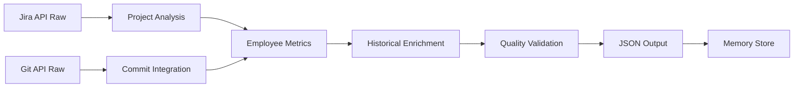
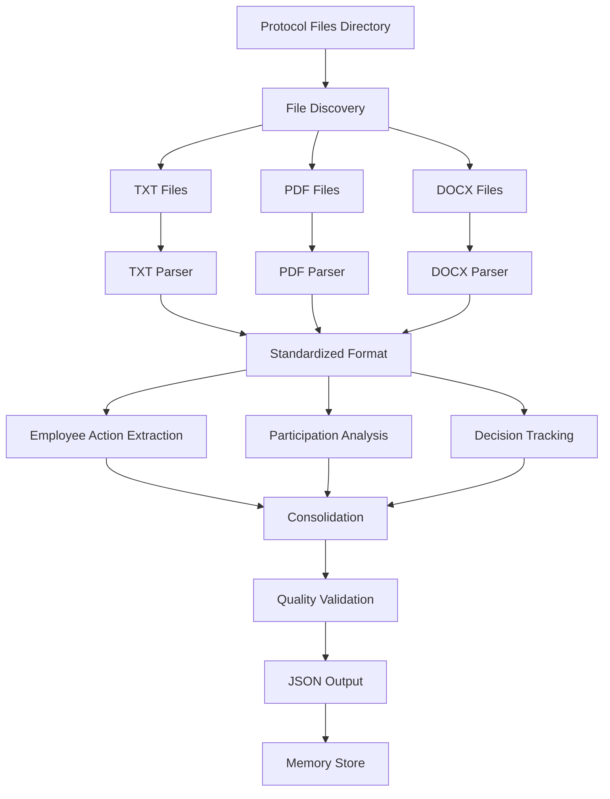

# Data Flow Design - MTS MultAgent Scheduled Architecture

## 🌊 **Data Flow Architecture Overview**

**Principle:** JSON-first with human-readable reports  
**Persistence:** File-based JSON memory store  
**Flow Direction:** External APIs → JSON Store → Human Reports → Confluence  
**Data Types:** Structured JSON, unstructured text, binary files  

---

## 🔄 **COMPLETE DATA FLOW MAP**

### **High-Level Data Flow:**
```
🔍 EXTERNAL DATA SOURCES
    ├── Jira API (multiple projects)
    ├── File System (meeting protocols)
    └── Git API (commit data)
        ↓
🤖 SCHEDULED AGENTS (JSON Processing)
    ├── DailyJiraAnalyzer → JSON
    ├── DailyMeetingAnalyzer → JSON
    ├── DailySummaryAgent → JSON + TXT
    └── WeeklyReporter → JSON + TXT + Confluence
        ↓
💾 PERSISTENCE LAYER
    ├── JSON Memory Store (/data/memory/json/)
    ├── Human Reports (/data/reports/human/)
    └── System State (/data/system/)
        ↓
📊 OUTPUT DESTINATIONS
    ├── Confluence Pages (weekly reports)
    ├── Email Notifications (alerts)
    └── Admin Dashboards (monitoring)
```

---

## 📊 **DETAILED DATA FLOWS BY AGENT**

### **1. DailyJiraAnalyzer Data Flow**

```python
# Input → Processing → Output Flow
class DailyJiraAnalyzerDataFlow:
    
    async def execute_data_flow(self, config: dict) -> JSON:
        """
        Полный data flow для Jira анализа
        """
        # 🔹 INPUT SOURCES
        input_data = {
            "jira_api_data": await self.fetch_jira_data(config.project_keys),
            "git_commit_data": await self.fetch_git_data(),
            "historical_data": await self.load_employee_history()
        }
        
        # 🔹 PROCESSING PIPELINE
        processed_data = {
            "projects": await self.analyze_projects(input_data.jira_api_data),
            "employees": await self.extract_employee_metrics(input_data),
            "status_changes": await self.track_status_changes(input_data),
            "git_integration": await self.integrate_git_commits(input_data)
        }
        
        # 🔹 ENRICHMENT LAYER
        enriched_data = await self.enrich_with_historical_context(
            processed_data, input_data.historical_data
        )
        
        # 🔹 QUALITY VALIDATION
        quality_validated = await self.validate_data_quality(enriched_data)
        
        # 🔹 OUTPUT GENERATION
        output_data = {
            "date": datetime.now().strftime("%Y-%m-%d"),
            "timestamp": datetime.now().isoformat(),
            "projects": quality_validated.projects,
            "employees": quality_validated.employees,
            "system_metrics": self.generate_system_metrics(),
            "data_quality": quality_validated.quality_score
        }
        
        # 🔹 PERSISTENCE
        await self.save_to_json_store(output_data, "daily_jira_data")
        
        return output_data
```

**Data Structure Evolution:**


#### **Input Data Sources:**
```json
{
  "jira_endpoints": {
    "projects": "/rest/api/3/project/search",
    "issues": "/rest/api/3/search",
    "changelog": "/rest/api/3/issue/{issueId}/changelog"
  },
  "git_endpoints": {
    "commits": "/api/v4/repository/commits",
    "users": "/api/v4/users"
  },
  "historical_data": {
    "employee_metrics_file": "employee_metrics_2026-03-24.json",
    "project_trends_file": "weekly_summary_data_2026-03-24.json"
  }
}
```

#### **Output JSON Schema:**
```json
{
  "$schema": "https://json-schema.org/draft/2020-12/schema",
  "type": "object",
  "properties": {
    "date": {"type": "string", "format": "date"},
    "timestamp": {"type": "string", "format": "date-time"},
    "projects": {
      "type": "object",
      "patternProperties": {
        "^[A-Z]+$": {
          "type": "object",
          "properties": {
            "total_tasks": {"type": "integer"},
            "completed_tasks": {"type": "integer"},
            "in_progress_tasks": {"type": "integer"},
            "blocked_tasks": {"type": "integer"},
            "employees": {"type": "object"}
          }
        }
      }
    },
    "system_metrics": {
      "type": "object",
      "properties": {
        "jira_api_calls": {"type": "integer"},
        "processing_time_seconds": {"type": "number"},
        "quality_score": {"type": "number", "minimum": 0, "maximum": 100}
      }
    }
  }
}
```

---

### **2. DailyMeetingAnalyzer Data Flow**

```python
# File System → Parsing → JSON Flow
class DailyMeetingAnalyzerDataFlow:
    
    async def execute_data_flow(self, config: dict) -> JSON:
        """
        Полный data flow для анализа протоколов совещаний
        """
        # 🔹 INPUT DISCOVERY
        input_files = await self.discover_protocol_files(
            config.protocols_path, 
            config.supported_formats
        )
        
        # 🔹 MULTI-FORMAT PARSING
        parsed_protocols = {}
        for file_path in input_files:
            if file_path.suffix.lower() == '.txt':
                parsed_protocols[str(file_path)] = await self.parse_txt_file(file_path)
            elif file_path.suffix.lower() == '.pdf':
                parsed_protocols[str(file_path)] = await self.parse_pdf_file(file_path)
            elif file_path.suffix.lower() == '.docx':
                parsed_protocols[str(file_path)] = await self.parse_docx_file(file_path)
        
        # 🔹 EMPLOYEE ACTION EXTRACTION
        employee_actions = await self.extract_employee_actions(parsed_protocols)
        
        # 🔹 PARTICIPATION ANALYSIS
        participation_data = await self.analyze_participation(parsed_protocols)
        
        # 🔹 DECISION TRACKING
        decisions_and_commitments = await self.track_decisions(parsed_protocols)
        
        # 🔹 DATA CONSOLIDATION
        consolidated_data = {
            "date": datetime.now().strftime("%Y-%m-%d"),
            "processed_files": list(parsed_protocols.keys()),
            "meetings": await self.structure_meeting_data(
                parsed_protocols, employee_actions, participation_data
            ),
            "daily_employee_summary": await self.generate_employee_summary(
                employee_actions, participation_data
            ),
            "decisions_made": decisions_and_commitments,
            "system_metrics": self.generate_processing_metrics(parsed_protocols)
        }
        
        # 🔹 QUALITY VALIDATION
        quality_validated = await self.validate meeting_data_quality(consolidated_data)
        
        # 🔹 PERSISTENCE
        await self.save_to_json_store(quality_validated, "daily_meeting_data")
        
        return quality_validated
```

**File Processing Flow:**


#### **File Processing Pipeline:**
```python
class MultiFormatProtocolParser:
    """
    Унифицированный парсер для разных форматов файлов
    """
    
    async def parse_txt_file(self, file_path: Path) -> dict:
        """Парсинг TXT файлов с LLM-анализом структуры"""
        raw_content = await self.read_text_file(file_path)
        
        prompt = f"""
        Проанализируй протокол совещания и извлеки:
        1. Участников и их роли
        2. Обсуждаемые темы
        3. Принятые решения
        4. Действия (action items) по сотрудникам
        5. Сроки выполнения
        
        Текст:
        {raw_content}
        
        Верни в формате JSON:
        {{
          "participants": [...],
          "topics": [...],
          "decisions": [...],
          "action_items": [...],
          "deadlines": [...]
        }}
        """
        
        parsed_content = await self.llm_client.complete(prompt)
        return self.parse_llm_response(parsed_content)
    
    async def parse_pdf_file(self, file_path: Path) -> dict:
        """Парсинг PDF документов"""
        import PyPDF2
        
        with open(file_path, 'rb') as file:
            pdf_reader = PyPDF2.PdfReader(file)
            raw_content = ""
            
            for page in pdf_reader.pages:
                raw_content += page.extract_text() + "\n"
        
        return await self.parse_llm_enhanced_content(raw_content, file_path)
    
    async def parse_docx_file(self, file_path: Path) -> dict:
        """Парсинг DOCX документов"""
        from docx import Document
        
        doc = Document(file_path)
        raw_content = ""
        
        for paragraph in doc.paragraphs:
            raw_content += paragraph.text + "\n"
        
        return await self.parse_llm_enhanced_content(raw_content, file_path)
```

---

### **3. DailySummaryAgent Data Flow**

```python
# JSON Consolidation → Human Reports Flow
class DailySummaryAgentDataFlow:
    
    async def execute_data_flow(self, config: dict) -> tuple[JSON, str]:
        """
        Data flow консолидации и генерации human-Readable отчетов
        """
        # 🔹 DATA LOADING (from JSON memory store)
        jira_data = await self.load_json_from_memory("daily_jira_data")
        meeting_data = await self.load_json_from_memory("daily_meeting_data")
        
        # 🔹 DATA VALIDATION
        validation_results = await self.validate_input_data(jira_data, meeting_data)
        
        if not validation_results.is_valid:
            raise DataValidationError(validation_results.errors)
        
        # 🔹 EMPLOYEE DATA CONSOLIDATION
        consolidated_employees = await self.consolidate_employee_metrics(jira_data, meeting_data)
        
        # 🔹 PROJECT DATA CONSOLIDATION
        consolidated_projects = await self.consolidate_project_metrics(jira_data, meeting_data)
        
        # 🔹 PERFORMANCE SCORE CALCULATION
        performance_scores = await self.calculate_performance_scores(consolidated_employees)
        
        # 🔹 TREND ANALYSIS
        trend_analysis = await self.analyze_daily_trends(consolidated_employees)
        
        # 🔹 JSON OUTPUT GENERATION
        json_output = {
            "date": datetime.now().strftime("%Y-%m-%d"),
            "consolidation_timestamp": datetime.now().isoformat(),
            "employee_summary": consolidated_employees,
            "project_summary": consolidated_projects,
            "performance_scores": performance_scores,
            "trend_analysis": trend_analysis,
            "system_health": await self.generate_system_health_check(),
            "data_sources": {
                "jira_data_file": f"daily_jira_data_{datetime.now().strftime('%Y-%m-%d')}.json",
                "meeting_data_file": f"daily_meeting_data_{datetime.now().strftime('%Y-%m-%d')}.json"
            }
        }
        
        # 🔹 HUMAN-READABLE REPORT GENERATION
        human_report = await self.generate_human_readable_report(json_output)
        
        # 🔹 QUALITY VALIDATION
        quality_validated_json = await self.validate_json_output(json_output)
        quality_validated_text = await self.validate_text_report(human_report)
        
        # 🔹 PERSISTENCE (JSON + TXT)
        await self.save_to_json_store(quality_validated_json, "daily_summary_data")
        await self.save_human_report(quality_validated_text, "daily_summary")
        
        return quality_validated_json, quality_validated_text
```

#### **Human Report Generation Pipeline:**
```python
class HumanReportGenerator:
    """
    Генератор human-readable отчетов из JSON данных
    """
    
    async def generate_human_readable_report(self, json_data: dict) -> str:
        """
        Генерация текстового отчета для людей
        """
        # 📊 REPORT HEADER
        header = self.generate_report_header(json_data)
        
        # 📋 PROJECT SUMMARY SECTION
        project_section = await self.generate_project_summary(json_data["project_summary"])
        
        # 👥 EMPLOYEE ANALYSIS SECTION
        employee_section = await self.generate_employee_analysis(json_data["employee_summary"])
        
        # 📈 PERFORMANCE INSIGHTS SECTION
        performance_section = await self.generate_performance_insights(json_data["performance_scores"])
        
        # 🔍 KEY OBSERVATIONS SECTION
        observations_section = await self.generate_key_observations(json_data)
        
        # ⚠️ ATTENTION REQUIRED SECTION
        alerts_section = await self.generate_attention_required(json_data)
        
        # 🔧 SYSTEM HEALTH SECTION
        health_section = await self.generate_system_health(json_data["system_health"])
        
        # 📄 FOOTER
        footer = self.generate_report_footer()
        
        # 🎯 ASSEMBLE FINAL REPORT
        final_report = "\n\n".join([
            header,
            project_section,
            employee_section,
            performance_section,
            observations_section,
            alerts_section,
            health_section,
            footer
        ])
        
        return final_report
    
    async def generate_project_summary(self, project_data: dict) -> str:
        """Генерация секции сводки по проектам"""
        prompt = f"""
        Создай human-readable сводку по проектам на основе данных:
        
        {project_data}
        
        Используй формат:
        ## 📊 СВОДКА ПО ПРОЕКТАМ
        
        ### [Project Name]
        - Всего задач: X
        - Выполнено сегодня: X  
        - В работе: X
        - Заблокировано: X
        - Средний performance score: X.X
        - Ключевые достижения: ...
        - Требует внимания: ...
        
        Сделай текст понятным для менеджеров, без технических деталей.
        """
        
        return await self.llm_client.complete(prompt)
    
    async def generate_employee_analysis(self, employee_data: dict) -> str:
        """Генерация секции анализа сотрудников"""
        prompt = f"""
        Создай анализ по сотрудникам на основе данных:
        
        {employee_data}
        
        Для каждого сотрудника включи:
        - Имя и роль
        - Performance score с emoji индикатором
        - Ключевые метрики (задачи, коммиты, совещания)
        - Позитивные моменты
        - Зоны для улучшения
        
        Используй empathetic tone, конструктивную обратную связь.
        """
        
        return await self.llm_client.complete(prompt)
```

#### **Human Report Template:**
```markdown
# ЕЖЕДНЕВНЫЙ ОТЧЕТ ПО ПРОЕКТАМ И СОТРУДНИКАМ
============================================
Дата: {{date}}

## 📊 СВОДКА ПО ПРОЕКТАМ

### {{project_name}}
- Всего задач: {{total_tasks}}
- Выполнено сегодня: {{completed_today}}
- В работе: {{in_progress}}
- Заблокировано: {{blocked}}
- Средний performance score: {{avg_score}}

## 👥 АНАЛИТИКА ПО СОТРУДНИКАМ

### {{employee_name}} ({{role}})
**Daily Performance Score: {{score}}** {{emoji_indicator}}

📋 Задачи:
- Всего: {{total}} | Завершено: {{done}} | В работе: {{in_progress}}

🤝 Совещания:
- Посещено: {{meetings}}/{{total_meetings}}
- Action items: {{completed_items}}/{{assigned_items}}

## 🔍 КЛЮЧЕВЫЕ НАБЛЮДЕНИЯ

{{llm_generated_insights}}

## ⚠️ ТРЕБУЕТ ВНИМАНИЯ

{{attention_items}}

---
*Сгенерировано: {{timestamp}}*
*Источник: Jira + Meeting Protocols*
```

---

### **4. WeeklyReporter Data Flow**

```python
# Multi-Day JSON Consolidation → Confluence Flow
class WeeklyReporterDataFlow:
    
    async def execute_data_flow(self, config: dict) -> tuple[JSON, str, str]:
        """
        Data flow недельного анализа и публикации в Confluence
        """
        # 🔹 HISTORICAL DATA COLLECTION
        week_start = datetime.now() - timedelta(days=6)
        daily_data_files = await self.collect_daily_json_files(week_start)
        
        # 🔹 MULTI-DAY DATA LOADING
        week_data = []
        for file_path in daily_data_files:
            day_data = await self.load_json_file(file_path)
            week_data.append(day_data)
        
        # 🔹 WEEKLY AGGREGATION
        weekly_aggregates = await self.aggregate_weekly_metrics(week_data)
        
        # 🔹 TREND ANALYSIS
        trend_analysis = await self.analyze_weekly_trends(week_data)
        
        # 🔹 EMPLOYEE PERFORMANCE INSIGHTS
        employee_insights = await self.generate_employee_insights(weekly_aggregates)
        
        # 🔹 PROJECT VELOCITY ANALYSIS
        project_insights = await self.analyze_project_velocity(week_data)
        
        # 🔹 PREDICTIVE INSIGHTS (Future Feature)
        # predictive_analytics = await self.generate_predictions(week_data)
        
        # 🔹 CONSOLIDATED JSON OUTPUT
        json_output = {
            "week_start": week_start.strftime("%Y-%m-%d"),
            "week_end": datetime.now().strftime("%Y-%m-%d"),
            "analysis_timestamp": datetime.now().isoformat(),
            "week_summary": weekly_aggregates,
            "employee_weekly_performance": employee_insights,
            "project_insights": project_insights,
            "trend_analysis": trend_analysis,
            "data_sources": {
                "daily_files": [f.name for f in daily_data_files],
                "
