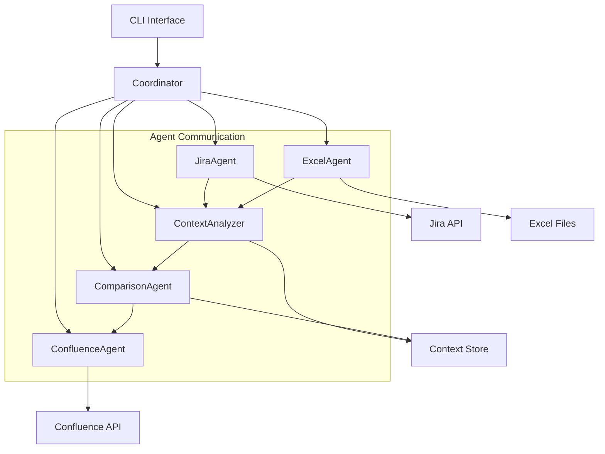

# System Patterns - MTS_MultAgent

## Архитектурная диаграмма



## Паттерн координации агентов

### Orchestrator Pattern
```python
class Coordinator:
    async def execute_workflow(self, task_description: str):
        # 1. JiraAgent: Получение данных из Jira
        jira_data = await self.jira_agent.get_meeting_protocols(task_description)
        
        # 2. ContextAnalyzer: Анализ контекста
        context = await self.context_analyzer.analyze(jira_data, task_description)
        
        # 3. ExcelAgent: Извлечение данных
        excel_data = await self.excel_agent.extract_data(context)
        
        # 4. ComparisonAgent: Сравнительный анализ
        comparison = await self.comparison_agent.compare(jira_data, excel_data)
        
        # 5. ConfluenceAgent: Публикация
        result = await self.confluence_agent.publish(context, excel_data, comparison)
        
        return result
```

## Архитектурные паттерны

### 1. Agent Pattern
Каждый агент является независимым компонентом:
- **Единый интерфейс**: `BaseAgent` с методами `execute()` и `validate()`
- **Асинхронность**: Все операции неблокирующие
- **Изоляция**: Агенты не зависят друг от друга напрямую
- **Конфигурация**: Каждый агент имеет собственную конфигурацию

### 2. Pipeline Pattern
Обработка данных через конвейер:
```
Input → JiraAgent → ContextAnalyzer → ExcelAgent → ComparisonAgent → ConfluenceAgent → Output
```

### 3. Strategy Pattern
Разные стратегии для разных типов задач:
- **ProjectAnalysisStrategy**: Анализ проектов
- **MeetingSummaryStrategy**: Сводки совещаний
- **ReportGenerationStrategy**: Генерация отчетов

### 4. Observer Pattern
Мониторинг состояний агентов:
- **EventBus**: Централизованная обработка событий
- **Logging**: Единая система логирования
- **Metrics**: Сбор метрик производительности

## Ключевые технические решения

### Асинхронная архитектура
```python
# Использование asyncio для параллельной работы
async def parallel_execution():
    tasks = [
        jira_agent.fetch_data(),
        excel_agent.prepare_queries()
    ]
    results = await asyncio.gather(*tasks)
    return results
```

### Конфигурация через среду
```python
# Переменные окружения для всех параметров
JIRA_TOKEN = os.getenv("JIRA_ACCESS_TOKEN")
CONFLUENCE_TOKEN = os.getenv("CONFLUENCE_ACCESS_TOKEN")
PROJECT_NAME = os.getenv("PROJECT_NAME")
```

### Обработка ошибок
```python
# Graceful degradation
class Agent:
    async def execute_with_fallback(self, task):
        try:
            return await self.execute(task)
        except Exception as e:
            logger.error(f"Agent {self.name} failed: {e}")
            return await self.fallback_strategy(task)
```

## Взаимодействие компонентов

### Data Flow
1. **Request**: CLI получает задачу
2. **Validation**: Coordinator валидирует входные данные
3. **Execution**: Последовательное выполнение агентов
4. **Aggregation**: Сбор результатов
5. **Response**: Возврат результата пользователю

### Error Handling Flow
1. **Detection**: Агент обнаруживает ошибку
2. **Logging**: Логирование в общий системе
3. **Fallback**: Попытка альтернативного решения
4. **Reporting**:Сообщение пользователю
5. **Recovery**: Возобновление работы

### Performance Patterns
- **Connection Pooling**: Повторное использование HTTP соединений
- **Caching**: Кэширование результатов запросов
- **Batching**: Пакетная обработка данных
- **Lazy Loading**: Загрузка данных по необходимости

## Масштабирование

### Горизонтальное масштабирование
- **Multiple Agents**: Запуск нескольких экземпляров агентов
- **Load Balancer**: Распределение нагрузки
- **Queue System**: Очереди задач

### Вертикальное масштабирование
- **Resource Management**: Управление памятью и CPU
- **Optimization**: Оптимизация алгоритмов
- **Profiling**: Мониторинг производительности
