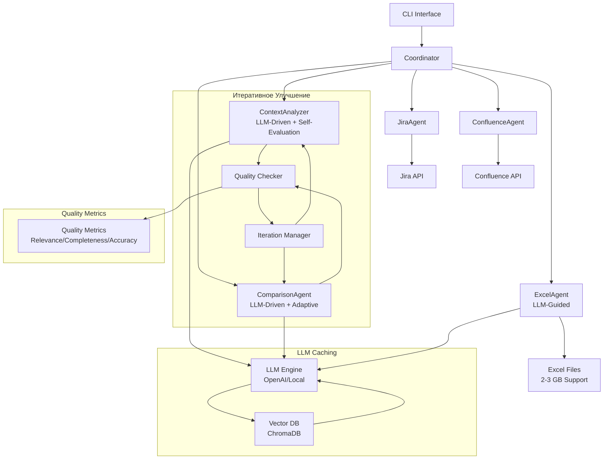

# System Patterns - MTS_MultAgent LLM-Driven Architecture

## 🧠 НОВАЯ LLM-CENTRIC АРХИТЕКТУРНАЯ ДИАГРАММА



## 🔄 ИТЕРАТИВНЫЙ ПАТТЕРН УЛУЧШЕНИЯ

### Core Iterative Pattern
```python
class IterativeImprovementPattern:
    """Базовый паттерн для итеративного улучшения через LLM"""
    
    async def improve_until_convergence(
        self,
        initial_input: Any,
        quality_threshold: float = 85.0,
        max_iterations: int = 5
    ) -> IterationResult:
        
        current_iteration = 0
        best_result = None
        best_quality = 0.0
        quality_history = []
        
        while current_iteration < max_iterations:
            # LLM анализ и улучшение
            improved_result = await self.llm_improve(
                initial_input, 
                previous_result=best_result,
                iteration=current_iteration
            )
            
            # LLM оценка качества
            quality_score = await self.llm_evaluate_quality(
                improved_result, 
                initial_input
            )
            
            quality_history.append(quality_score)
            
            # Проверка сходимости
            if self._has_converged(quality_history) or quality_score >= quality_threshold:
                break
            
            # Сохранение лучшего результата
            if quality_score > best_quality:
                best_quality = quality_score
                best_result = improved_result
            
            current_iteration += 1
        
        return IterationResult(
            final_result=best_result,
            quality_score=best_quality,
            iterations=current_iteration,
            quality_history=quality_history,
            converged=quality_score >= quality_threshold
        )
```

### Quality Convergence Detector
```python
class QualityConvergenceDetector:
    """Алгоритм определения сходимости качества"""
    
    def __init__(self, min_improvement: float = 5.0, window_size: int = 3):
        self.min_improvement = min_improvement
        self.window_size = window_size
        self.quality_history = []
        
    def has_converged(self, current_quality: float) -> bool:
        """Определение сходимости на основе истории качества"""
        self.quality_history.append(current_quality)
        
        if len(self.quality_history) < self.window_size:
            return False
        
        recent_qualities = self.quality_history[-self.window_size:]
        improvements = [
            recent_qualities[i] - recent_qualities[i-1]
            for i in range(1, len(recent_qualities))
        ]
        
        avg_improvement = sum(improvements) / len(improvements)
        return avg_improvement < self.min_improvement
```

## 🧠 LLM-DRIVEN ПАТТЕРНЫ

### 1. LLM Request-Response Pattern
```python
class LLMRequestPattern:
    """Стандартизированный паттерн для LLM запросов"""
    
    async def execute_llm_request(
        self, 
        prompt_template: str, 
        context: Dict[str, Any],
        cache_key: Optional[str] = None
    ) -> LLMResponse:
        
        # 1. Check cache
        if cache_key:
            cached_response = await self.cache.get(cache_key)
            if cached_response:
                return cached_response
        
        # 2. Format prompt
        formatted_prompt = self.format_prompt(prompt_template, context)
        
        # 3. Execute with retry
        response = await self.llm_client.complete_with_retry(
            prompt=formatted_prompt,
            max_retries=3,
            timeout=60
        )
        
        # 4. Parse and validate
        parsed_response = self.parse_llm_response(response)
        
        # 5. Cache result
        if cache_key and parsed_response.is_valid:
            await self.cache.set(cache_key, parsed_response, ttl=3600)
        
        return parsed_response
```

### 2. LLM Quality Evaluation Pattern
```python
class LLMQualityEvaluationPattern:
    """Паттерн оценки качества через LLM"""
    
    async def evaluate_quality(
        self, 
        result_data: Dict, 
        expected_context: str,
        evaluation_criteria: List[str]
    ) -> QualityMetrics:
        
        prompt = f"""
        Оцени качество анализа данных по отношению к исходному контексту.
        
        ИСХОДНЫЙ КОНТЕКСТ:
        {expected_context}
        
        ПОЛУЧЕННЫЕ ДАННЫЕ:
        {self._format_data_for_evaluation(result_data)}
        
        КРИТЕРИИ ОЦЕНКИ:
        {', '.join(evaluation_criteria)}
        
        ОЦЕНИ ПО ШКАЛЕ 0-100%:
        1. Relevance Score: Насколько данные соответствуют контексту
        2. Completeness Score: Полнота охвата аспектов контекста
        3. Accuracy Score: Точность извлечения и интерпретации
        4. Overall Quality: Интегральная оценка качества
        
        Формат: JSON с метриками и объяснением
        """
        
        response = await self.llm_client.complete(prompt)
        return self._parse_quality_metrics(response)
```

### 3. LLM-Guided Column Mapping Pattern
```python
class LLMColumnMappingPattern:
    """LLM-driven интеллектуальное сопоставление колонок"""
    
    async def map_columns_intelligently(
        self, 
        available_columns: List[str], 
        analysis_context: str,
        sample_data: Dict[str, List[Any]]
    ) -> ColumnMappingResult:
        
        prompt = f"""
        Проанализируй доступные колонки в Excel и сопоставь их с потребностями анализа.
        
        КОНТЕКСТ ЗАДАЧИ:
        {analysis_context}
        
        ДОСТУПНЫЕ КОЛОНКИ:
        {', '.join(available_columns)}
        
        ОБРАЗЦЫ ДАННЫХ:
        {self._format_sample_data(sample_data)}
        
        ОПРЕДЕЛИ:
        1. Какие колонки релевантны для анализа?
        2. Какова семантика каждой колонки?
        3. Как использовать каждую колонку для ответа на вопросы из контекста?
        4. Какие дополнительные обработки нужны?
        
        Формат: JSON с маппингом и объяснениями
        """
        
        response = await self.llm_client.complete(prompt)
        return self._parse_column_mapping(response)
```

## 🔄 ARCHITECTURAL PATTERNS

### 1. Orchestrator Pattern with Iteration
```python
class IntelligentOrchestrator:
    """Координатор с итеративным улучшением"""
    
    async def execute_intelligent_workflow(self, task_description: str):
        """Основной workflow с итеративным улучшением"""
        
        # 1. JiraAgent (без изменений)
        jira_result = await self.jira_agent.execute_with_fallback({
            "task_description": task_description
        })
        
        # 2. ContextAnalyzer с итеративным улучшением
        context_task = ContextTask(
            jira_data=jira_result.data,
            task_description=task_description,
            original_context=jira_result.data.get("context", "")
        )
        
        excel_structure = await self.excel_agent.analyze_structure_with_llm()
        context_result = await self.context_analyzer.iterative_improvement_loop(
            context_task, excel_structure
        )
        
        # 3. ExcelAgent исполнение LLM-запросов
        excel_result = await self.excel_agent.execute_llm_generated_queries(
            context_result.intelligent_queries
        )
        
        # 4. ComparisonAgent с итеративным улучшением
        comparison_result = await self.comparison_agent.compare_with_iterative_improvement(
            jira_result.data, excel_result, context_result
        )
        
        # 5. Публикация с метриками качества
        final_result = await self.confluence_agent.create_intelligent_page({
            "title": self.generate_title(task_description),
            "content": self.format_llm_enhanced_content(context_result, comparison_result),
            "tables": excel_result.get("tables", []),
            "quality_metrics": context_result.quality_metrics,
            "iteration_info": context_result.iteration_result
        })
        
        return final_result
```

### 2. LLM Pipeline Pattern
```python
class LLMPipelinePattern:
    """Pipeline с LLM-проверкой на каждом этапе"""
    
    async def execute_pipeline_with_validation(self, data: Any):
        """Исполнение pipeline с LLM-валидацией"""
        
        stages = [
            ("extraction", self.extract_data),
            ("analysis", self.analyze_data),
            ("comparison", self.compare_data),
            ("generation", self.generate_report)
        ]
        
        pipeline_result = PipelineResult()
        
        for stage_name, stage_func in stages:
            # Исполнение этапа
            stage_result = await stage_func(data)
            
            # LLM-валидация результата этапа
            validation_result = await self.validate_stage_result(
                stage_result, stage_name
            )
            
            if not validation_result.is_acceptable:
                # Итеративное улучшение этапа
                improved_result = await self.improve_stage_result(
                    stage_result, validation_result.feedback
                )
                stage_result = improved_result
            
            pipeline_result.add_stage_result(stage_name, stage_result)
            data = stage_result  # Pass to next stage
        
        return pipeline_result
```

### 3. Adaptive Strategy Pattern
```python
class AdaptiveStrategyPattern:
    """Адаптивная стратегия на основе LLM-анализа"""
    
    async def select_optimal_strategy(
        self, 
        task_context: Dict[str, Any],
        available_strategies: List[str]
    ) -> SelectedStrategy:
        
        prompt = f"""
        Проанализируй задачу и выбери оптимальную стратегию анализа.
        
        КОНТЕКСТ ЗАДАЧИ:
        {task_context}
        
        ДОСТУПНЫЕ СТРАТЕГИИ:
        {', '.join(available_strategies)}
        
        ВЫБЕРИ НАИЛУЧШУЮ СТРАТЕГИЮ И ОБЪЯСНИ ВЫБОР.
        
        Критерии:
        1. Соответствие типу задачи
        2. Эффективность для данного контекста
        3. Вероятность достижения качественного результата
        
        Формат: JSON с выбранной стратегией и обоснованием
        """
        
        response = await self.llm_client.complete(prompt)
        strategy_data = self._parse_strategy_selection(response)
        
        return SelectedStrategy(
            name=strategy_data.strategy,
            confidence=strategy_data.confidence,
            reasoning=strategy_data.reasoning
        )
```

## 🎯 PERFORMANCE PATTERNS

### 1. Concurrent LLM Processing
```python
class ConcurrentLLMProcessor:
    """Параллельная обработка LLM запросов"""
    
    def __init__(self, max_concurrent: int = 3):
        self.semaphore = Semaphore(max_concurrent)
        self.request_queue = asyncio.Queue()
        
    async def process_batch_requests(
        self, 
        requests: List[LLMRequest]
    ) -> List[LLMResponse]:
        """Параллельная обработка с rate limiting"""
        
        async def process_single_request(request):
            async with self.semaphore:
                return await self.llm_client.complete_with_retry(
                    prompt=request.prompt,
                    max_tokens=request.max_tokens,
                    temperature=request.temperature
                )
        
        # Создание задач для параллельного выполнения
        tasks = [process_single_request(req) for req in requests]
        
        # Выполнение с gathering результатов
        responses = await asyncio.gather(*tasks, return_exceptions=True)
        
        # Обработка исключений
        valid_responses = []
        for i, response in enumerate(responses):
            if isinstance(response, Exception):
                logger.error(f"Request {i} failed: {response}")
                valid_responses.append(LLMResponse.error_response(str(response)))
            else:
                valid_responses.append(response)
        
        return valid_responses
```

### 2. Intelligent Caching Pattern
```python
class IntelligentLLMCache:
    """Интеллектуальное кэширование LLM запросов"""
    
    def __init__(self):
        self.vector_db = ChromaDB()
        self.cache_stats = CacheStats()
        
    async def get_cached_response(
        self, 
        prompt: str, 
        context_hash: str,
        similarity_threshold: float = 0.85
    ) -> Optional[LLMResponse]:
        
        # Поиск похожих промптов в векторной базе
        similar_prompts = await self.vector_db.similarity_search(
            query=prompt,
            threshold=similarity_threshold
        )
        
        if similar_prompts:
            best_match = similar_prompts[0]
            self.cache_stats.record_hit()
            return LLMResponse.from_cache(best_match.response)
        
        self.cache_stats.record_miss()
        return None
    
    async def cache_response(
        self, 
        prompt: str, 
        response: LLMResponse, 
        context_hash: str
    ):
        """Кэширование с векторизацией"""
        
        await self.vector_db.add_document({
            "prompt": prompt,
            "response": response.to_dict(),
            "context_hash": context_hash,
            "timestamp": datetime.utcnow().isoformat()
        })
```

## 🔄 ERROR HANDLING PATTERNS

### 1. LLM Fallback Pattern
```python
class LLMFallbackPattern:
    """Fallback стратегия для LLM отказов"""
    
    def __init__(self):
        self.providers = [
            OpenAIClient(),
            LocalLLMClient(),
            MockLLMClient()  # Ultimate fallback
        ]
        
    async def execute_with_fallback(
        self, 
        prompt: str, 
        max_failures: int = 2
    ) -> LLMResponse:
        
        last_exception = None
        
        for provider in self.providers:
            try:
                response = await provider.complete(prompt)
                if response.is_valid:
                    return response
                    
            except Exception as e:
                last_exception = e
                logger.warning(f"Provider {provider.name} failed: {e}")
                continue
        
        # Все провайдеры недоступны
        raise LLMAllProvidersFailedException(
            f"All LLM providers failed. Last error: {last_exception}"
        )
```

### 2. Graceful Degradation Pattern
```python
class GracefulDegradationPattern:
    """Плавное снижение функциональности при проблемах"""
    
    async def execute_with_degradation(
        self, 
        primary_operation: Callable,
        fallback_operations: List[Callable],
        context: Dict[str, Any]
    ):
        
        operations = [primary_operation] + fallback_operations
        
        for i, operation in enumerate(operations):
            try:
                result = await operation(context)
                
                # Логирование уровня degradation
                if i == 0:
                    logger.info("Primary operation succeeded")
                else:
                    logger.warning(f"Fallback operation {i} succeeded")
                
                return result with Context(
                    operation_used=operation.__name__,
                    degradation_level=i
                )
                
            except Exception as e:
                logger.error(f"Operation {i} failed: {e}")
                continue
        
        raise AllOperationsFailedException("All operations failed")
```

## 📊 MONITORING PATTERNS

### 1. LLM Metrics Collection
```python
class LLMMetricsCollector:
    """Сбор метрик LLM производительности"""
    
    def __init__(self):
        self.metrics = {
            "request_count": 0,
            "total_tokens": 0,
            "response_times": [],
            "error_rates": {},
            "quality_scores": [],
            "cache_hit_rate": 0.0
        }
        
    async def track_request(
        self, 
        operation: str,
        tokens_used: int,
        response_time: float,
        quality_score: Optional[float] = None,
        cache_hit: bool = False
    ):
        
        self.metrics["request_count"] += 1
        self.metrics["total_tokens"] += tokens_used
        self.metrics["response_times"].append(response_time)
        
        if quality_score:
            self.metrics["quality_scores"].append(quality_score)
        
        # Update cache hit rate
        if cache_hit:
            self.metrics["cache_hit_rate"] = (
                self.metrics.get("cache_hits", 0) + 1
            ) / self.metrics["request_count
```

### 2. Quality Tracking Pattern
```python
class QualityTrackingPattern:
    """Отслеживание качества итеративного улучшения"""
    
    def __init__(self):
        self.iteration_history = []
        self.convergence_metrics = {}
        
    async def track_iteration(
        self,
        iteration_number: int,
        quality_metrics: QualityMetrics,
        improvements_made: List[str]
    ):
        
        iteration_record = {
            "iteration": iteration_number,
            "timestamp": datetime.utcnow().isoformat(),
            "quality_metrics": quality_metrics.to_dict(),
            "improvements": improvements_made
        }
        
        self.iteration_history.append(iteration_record)
        
        # Анализ сходимости
        if len(self.iteration_history) > 1:
            convergence_analysis = self.analyze_convergence_trend()
            self.convergence_metrics[iteration_number] = convergence_analysis
    
    def analyze_convergence_trend(self) -> Dict[str
